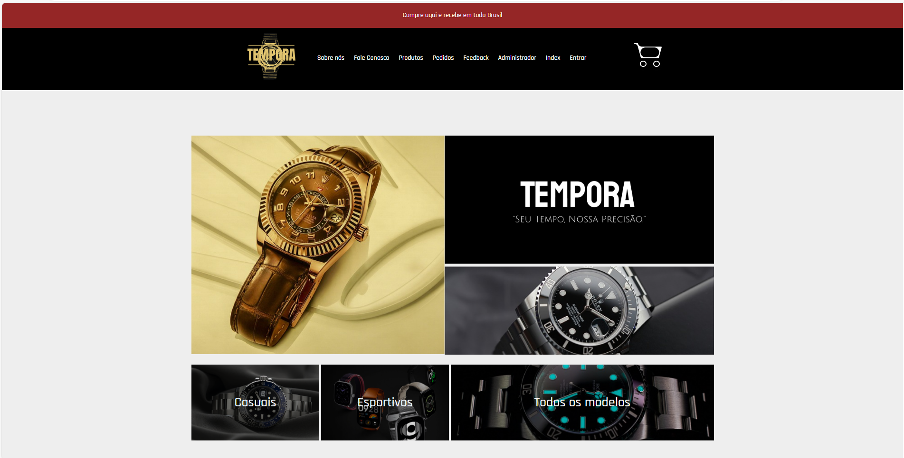
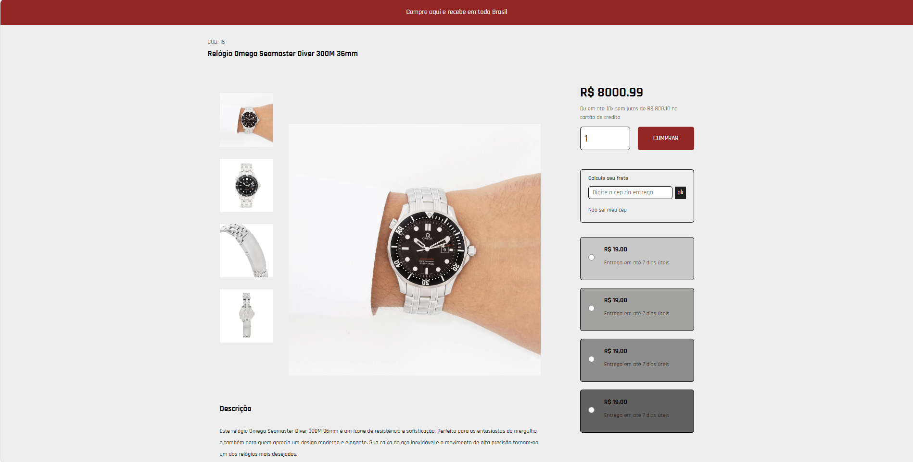
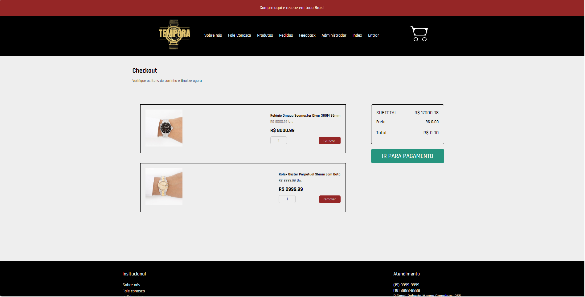
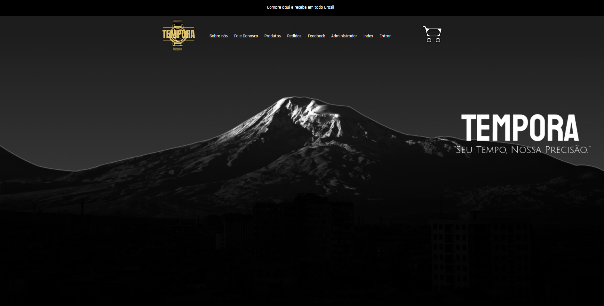

# TEMPORA - E-commerce de Relógios

**TEMPORA** é um e-commerce especializado na venda de relógios. Este projeto foi desenvolvido como parte do **Projeto Integrador do Senai**, integrando o aprendizado de diversas disciplinas do primeiro semestre. A plataforma oferece uma experiência de compra intuitiva, com funcionalidades modernas e acessíveis para consumidores que buscam qualidade e praticidade na aquisição de relógios.

**INDEX**
  <!-- Exemplo de imagem local -->
**PRODUTO INDIVIDUAL**
  <!-- Exemplo de imagem local -->
**PÁGINA CARRINHO**
  <!-- Exemplo de imagem local -->
**PÁGINA SOBRE NÓS**
  <!-- Exemplo de imagem local -->

## 🎁 Páginas do Projeto
- **index**: Página inicial do projeto.
- **Produtos**: Página de todos os produtos.
- **Página de produto unico**: Página para um produto específico.
- **Sobre nós**: Página sobre nós (com PARALLAX😉).
- **Sobre contato**: Página de contatos.
- **Página de administrador**: Página do administrador.

## 💡 Sobre o Projeto

O projeto **TEMPORA** tem como objetivo a criação de uma plataforma de e-commerce completa, focada na venda de relógios, que oferece:

- **Catálogo de Produtos**: Exibição de relógios de diversas marcas.
- **Carrousel de produtos**: Exibição de relógios em cards.
- **Sistema de Pagamento**: Integração com meios de pagamento populares (FRONT END SOMENTE).
- **Segurança**: Utilização de boas práticas para garantir a segurança das informações dos usuários.


## 🚀 Tecnologias Utilizadas

Este projeto foi desenvolvido utilizando as seguintes tecnologias:

- **Frontend**: HTML, CSS, JavaScript
    
## ⚙️ Princiáis Funcionalidades

- **Catálogo de Produtos**: Página com a listagem de relógios, com filtros por categoria, preço e marca (FRONT END SOMENTE).
- **Carrinho de Compras**: Funcionalidade para adicionar e remover produtos do carrinho.
- **Administração de Produtos**: Painel administrativo para visualizar produtos.
- **Exportação em excel**: O administrador poderá exportar pedidos para um excel.


Para garantir que todas as dependências do projeto **TEMPORA - E-commerce de Relógios** sejam instaladas corretamente, é fundamental executar o comando `npm install` no diretório correto. Veja os passos para configurar o ambiente:  

---

### **Aviso: Configure o Ambiente de Desenvolvimento**  

1. **Certifique-se de estar no diretório do projeto:**  
   - Abra o terminal ou prompt de comando.  
   - Navegue até o diretório principal do projeto TEMPORA:  
     ```bash
     cd /caminho/para/o/diretorio/ecommerce
     ```

2. **Instale as dependências do projeto:**  
   - No diretório raiz onde o arquivo `package.json` está localizado, execute:  
     ```bash
     npm install
     ```
   - Este comando irá instalar todas as bibliotecas e pacotes necessários descritos no `package.json`.

 TEMPORA! 🚀


